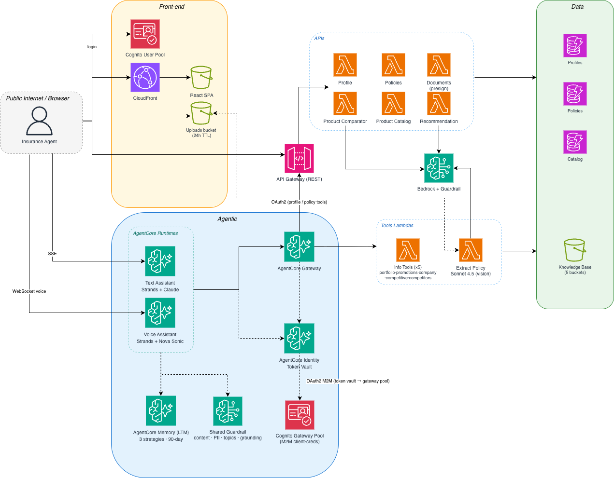

# Frictionless Insurance Advisor

**Frictionless Insurance Advisor** is an AI co-pilot for insurance advisors at the fictional Unicorn Insurance, built end-to-end on Amazon Bedrock AgentCore.

> An AI co-pilot that gives every advisor instant, coverage-aware insight into each customer's portfolio, products, and competitors — so they walk into every conversation already prepared.

Advisors sign in to a React app and either chat with the agent or talk to it in real time. The agent reaches across eight MCP tools — customer profiles, policies, the Unicorn product catalog, current promotions, company facts, competitive talking points, competitor product references, and policy-document extraction — to answer questions grounded in real customer data. It tracks third-party policies the customer holds elsewhere so cross-sell suggestions stay coverage-aware, can onboard a brand-new prospect just by talking, accepts uploaded policy documents (PDF / image / markdown) and extracts structured fields the advisor confirms before saving, and remembers context per customer across sessions through AgentCore Memory. Separate comparator and recommender Lambdas generate side-by-side product views and structured coverage-gap analyses on demand.

## Why it matters

| For the advisor | For the customer | For the business |
|---|---|---|
| No more portal-flipping. Profile, gaps, promos, and competitive answers ready the moment a customer is selected. Drag a competitor PDF in and the policy is on file in seconds. | Faster, more personal meetings. Advice grounded in actual coverage. Confident answers about competitors. | Shorter prep time. Higher-quality cross-sell. Faster new-advisor ramp. PII, compliance and "no quote / no bind" boundaries baked in. |

## Models

| Surface | Model | Why |
|---|---|---|
| Conversational text agent | Anthropic **Claude Haiku 4.5** | Fast, low-cost multi-turn reasoning with tool use |
| Voice agent | Amazon **Nova Sonic 2** | Bidirectional voice with low end-to-end latency |
| Comparator + recommender Lambdas | Anthropic **Claude Haiku 4.5** | Fast structured-output generation for tool-forced JSON |
| Document extraction (vision) | Anthropic **Claude Sonnet 4.5** | PDF/image vision for third-party policy field extraction |

## Architecture



> Rendered from the `architecture.drawio` source.

```
       React + Vite SPA                                Cognito user pool
       (CloudFront-hosted, or `npm run dev` locally)   (advisors)
                │
                │  Cognito JWT (Bearer)
                │
                ├─────────────────────────────────────────────────────┐
                │                                                     │
                ▼                                                     ▼
   AgentCore Runtime (text)                              API Gateway + WAF
   AgentCore Runtime (voice)                             (profile, policy,
   container · ARM64                                     catalog, comparator,
   Strands · Haiku / Nova Sonic                          recommend, signup,
                │                                        documents)
                │  M2M JWT via AgentCore Identity Token Vault
                ▼
   AgentCore Gateway (MCP, 8 tool targets)
                │
                ├── OAuth2 → API Gateway → λ profile, λ policies → DynamoDB
                ├── IAM    → λ portfolio · promotions · company · competitive · competitors → S3
                └── IAM    → λ extract_policy → S3 (uploaded docs) → Bedrock vision
                ▲
                │  + AgentCore Memory (summaries · preferences · facts)
                │  + Bedrock Guardrail (content + topics + grounding + PII)
```

## CDK stacks

Five stacks, deployed in order:

| Stack | Purpose |
|---|---|
| `insadv-01-auth` | Cognito user pool (advisors) + gateway pool (M2M) + app + runtime + gateway clients |
| `insadv-02-tools` | DynamoDB profiles + policies + catalog tables; 14 Lambdas (profile, policies, portfolio, promotions, company, competitive, competitors, catalog, comparator, recommend, signup, documents, extract_policy, mock_data); API Gateway with WAF (rate-limited /signup); S3 markdown knowledge bases + uploads bucket; **shared Bedrock Guardrail** consumed by every model surface; AWS Budget on Bedrock + Lambda spend; KMS key for log encryption |
| `insadv-03-agentcore` | AgentCore Runtime (Claude Haiku 4.5 text agent), Gateway, eight tool targets, AgentCore Identity OAuth2 credential providers, long-term memory (summary + preference + semantic strategies, 90-day TTL) |
| `insadv-04-voice` | AgentCore Runtime (Nova Sonic 2 voice agent), shares the same gateway, memory, guardrail and Cognito as the text runtime |
| `insadv-05-frontend` | S3 site bucket + CloudFront distribution with Origin Access Control hosting the React build |

`deploy.sh` handles the ordering: backend stacks first (parallel where the DAG allows via `--concurrency 4`), then `npm run build` against fresh SSM env vars, then the frontend stack. The frontend stack only synthesises after `react-frontend/dist/` exists, so a cold `cdk deploy insadv-01-auth` still works on a clean checkout.

After every backend deploy, `scripts/assert_runtime_header_config.py` re-asserts `requestHeaderConfiguration={requestHeaderAllowlist:["Authorization"]}` on both AgentCore runtimes. CDK's AwsCustomResource provider Lambda installs the AWS SDK at deploy time and historically silently dropped this field, leaving Authorization not forwarded into the container — the script uses our pinned boto3 to make the setting deterministic.

## Agent tools (MCP)

Eight tools exposed through the AgentCore Gateway. Read-only for Unicorn data, write-enabled for prospect onboarding and third-party policy tracking only.

| Tool | Source | Purpose |
|---|---|---|
| `get_profile` / `create_profile` / `update_profile` | Profile Lambda → DynamoDB | Customer profile read + prospect onboarding |
| `get_policy` / `create_third_party_policy` / `update_third_party_policy` / `delete_third_party_policy` | Policies Lambda → DynamoDB | Customer policy read + third-party policy CRUD (Unicorn-issued policies stay read-only) |
| `get_portfolio` | Portfolio Lambda → S3 | Unicorn product catalog |
| `get_promotions` | Promotions Lambda → S3 | Current promotions |
| `get_company_info` | Company Lambda → S3 | Unicorn — history, ratings, claims, support |
| `get_competitive_info` | Competitive Lambda → S3 | Unicorn's competitive talking points and head-to-head Q&A |
| `get_competitor_products` | Competitors Lambda → S3 | Reference info on fictional competitors BigRival, StarInsure, QuickSafe |
| `extract_policy_from_document` | Extract Policy Lambda → S3 + Bedrock vision | Reads an uploaded PDF/image/markdown and returns structured policy fields with defense-in-depth validators (numeric clamps, date sanity, injection-keyword heuristic, insurer rejection) |

The comparator (side-by-side product table) and recommender (coverage-gap analysis) are direct Bedrock Converse calls from their own Lambdas behind the API Gateway, not MCP tools — they're one-shot structured generations that don't benefit from the runtime's tool-use loop.

## Bedrock Guardrail

A single shared guardrail (`insurance-advisor-guardrail-shared`) lives in `insadv-02-tools` and gates every Bedrock call in the system: text agent, voice agent, comparator Lambda, recommender Lambda, extract_policy Lambda. The same policy, applied five ways. The published version is written to SSM (`/insadv/bedrock/guardrail-version`) on every policy change so all five callers pick up updates on cold start without a runtime redeploy.

| Policy | Configuration |
|---|---|
| Content filters | `SEXUAL`, `VIOLENCE`, `HATE`, `INSULTS`, `MISCONDUCT` at HIGH input + HIGH output. `PROMPT_ATTACK` at HIGH input only. |
| PII anonymized | `US_SOCIAL_SECURITY_NUMBER`, `CREDIT_DEBIT_CARD_NUMBER`, `US_BANK_ACCOUNT_NUMBER`, `CREDIT_DEBIT_CARD_CVV`, `CREDIT_DEBIT_CARD_EXPIRY`, `PIN`, `INTERNATIONAL_BANK_ACCOUNT_NUMBER`, `SWIFT_CODE`, `US_PASSPORT_NUMBER`, `DRIVER_ID`, `US_INDIVIDUAL_TAX_IDENTIFICATION_NUMBER`. |
| PII blocked (whole request refused) | `PASSWORD`, `AWS_ACCESS_KEY`, `AWS_SECRET_KEY`. |
| PII not anonymized — by design | `NAME`, `EMAIL`, `PHONE`, `ADDRESS`, `AGE`, `DATE_OF_BIRTH`. These are integral to legitimate advisor workflows; output-side log redaction is the right place for those. |
| Word policy | AWS-managed `PROFANITY` list. |
| Denied topics | `LegalAdvice`, `MedicalAdvice`, `InvestmentRecommendations` (asset-allocation / sub-account picks), `UnderwritingDecisions` (no binding "you are approved"), `TaxAdvice`. All `DENY`. |
| Contextual grounding | `GROUNDING` ≥ 0.75, `RELEVANCE` ≥ 0.5. Active on the comparator + recommender Lambdas (which tag their source markdown / customer profile / catalog as `grounding_source`); attached but inert on the text + voice runtimes (Strands tool results aren't tagged as sources). |

Interventions surface as a clean 400 with the configured `blocked_outputs_messaging`.

## Security posture

Security was a first-class design constraint. A number of hardening items are deliberately deferred for production (Cognito MFA, Macie PII detection, a business-event audit log, etc.).

Highlights of what's enforced today:

- **Advisor identity is JWT-only.** The runtime resolves the calling advisor exclusively from the verified Cognito JWT (forwarded via `requestHeaderConfiguration`); the request payload `advisorId` field has been removed and the runtime returns 401-equivalent if extraction fails. Voice WebSocket closes with 1008 if no validated identity is available.
- **Cross-tenant isolation** at the Lambda layer: `advisor-id-index` GSI is a key condition (not a filter) on every read, plus an explicit `advisor_id == calling_user` check on every mutation.
- **Sign-up is closed.** Cognito self-signup is org-blocked; the public `/signup` Lambda enforces a hard-coded allowlist (john.doe + jane.doe). WAF rate-limits the route at 100 req / 5 min / source IP.
- **Cost-bomb defense.** AWS Budget on Bedrock + Lambda spend with 50/80/100% SNS notifications. API Gateway throttling on `/comparator/compare` and `/recommend` (5 rps steady, 10 burst).
- **Document extraction safety net.** `extract_policy_from_document` clamps coverage and premium amounts to sane ranges, rejects non-current dates, refuses "Unicorn" as the third-party insurer, and forces low extraction confidence on injection-keyword matches; the agent's system prompt then switches to field-by-field confirmation before any write.
- **Log retention bounded.** All tools-stack Lambda log groups now have ONE_MONTH retention; the API Gateway access log group is encrypted with a customer-managed KMS key with rotation enabled.
- **AgentCore Memory TTL** capped at 90 days (down from the 365-day platform default) to bound the GDPR right-to-erasure window.

## Quick start

### Prerequisites

- AWS account + credentials in your shell, region `us-east-1`
- Python 3.13, [`uv`](https://docs.astral.sh/uv/)
- Node.js 18+
- A container builder running (Finch is supported; Docker / Colima also work)
- Bedrock model access in `us-east-1` for Claude Haiku 4.5, Claude Sonnet 4.5, and Nova Sonic 2

### Deploy

```bash
./deploy.sh
```

Runs `uv sync`, deploys backend stacks (`insadv-01-auth` → `04-voice` with `--concurrency 4`), runs the post-deploy header-config assertion, pulls SSM values into `react-frontend/.env.local` via `setup-env.sh`, runs `npm install && npm run build`, then deploys `insadv-05-frontend`. First deploy ~10 minutes (Cognito pools, WAF, agent + voice container builds, AgentCore runtime + memory provisioning). Subsequent redeploys are incremental.

The CloudFront URL is emitted as `insadv-05-frontend.SiteUrl`.

### Run locally instead

```bash
cd react-frontend
./run_app.sh
```

Opens at http://localhost:5173. First run auto-populates `.env.local` from SSM via `scripts/setup-env.sh`. The browser only ever holds a Cognito JWT — no AWS IAM credentials.

### Sign in

Use one of the demo advisors to see seeded customers:

- `john.doe@example.com` → Sarah, Emily, Robert, Lisa, Daniel
- `jane.doe@example.com` → Michael, Amanda, Jessica

Password must be 12+ chars with upper, lower, digit, and symbol. Sign-up goes through a backend `/signup` Lambda that calls Cognito `admin_create_user` + `admin_set_user_password` — needed because the AWS account's org policy blocks Cognito self-service signup. The Lambda enforces a hard-coded allowlist of the two demo emails.

### Sales pitch deck

In the running app, click the slideshow icon top-right of the nav. The Frictionless Insurance Advisor pitch deck opens at `/presentation/index.html` — speaker notes embedded (press `S` for the speaker view). Source files live in `react-frontend/public/presentation/`.

## Authentication and identity

Two channels, same Cognito JWT.

**1. Browser → AgentCore Runtime** (text + voice)
- React signs in via Amplify against the `insurance-advisor-user` Cognito pool.
- Text: HTTPS POST to `bedrock-agentcore.<region>.amazonaws.com/runtimes/{ARN}/invocations` with `Authorization: Bearer <jwt>`. Streams SSE. The runtime forwards the Authorization header into the container via `requestHeaderConfiguration` and verifies the JWT in-process.
- Voice: WebSocket to the same host's `/ws` path. Browsers can't set headers on a WebSocket, so the JWT travels base64url-encoded as a `Sec-WebSocket-Protocol` subprotocol — AgentCore's documented browser-OAuth path. The Authorization header is also forwarded for consistency with the text path.

**2. Browser → API Gateway** (profile, policy, catalog, comparator, recommender, signup, documents)
- Same JWT, this time validated by an API Gateway `CognitoUserPoolsAuthorizer` against the user pool. Methods require the `insurance-advisor-api/api.access` scope. Signup is the only `authorization_type=NONE` route — and it's allowlist-gated and WAF rate-limited.

**3. Runtime → Gateway** (machine-to-machine)
- Separate Cognito pool `insurance-advisor-gateway` with a service-only `runtime_client`.
- The runtime asks AgentCore Identity Token Vault for a short-lived M2M JWT and presents it to the gateway, whose authorizer accepts only that client.

**4. Gateway → tools**
- For profile + policy tools: OAuth2 Credential Provider `insurance-advisor-api-oauth` against the main user pool with `gateway_client` and the `insurance-advisor-api/api.access` scope.
- For everything else: direct IAM-scoped Lambda invoke.

Plus: shared Bedrock Guardrail on every model call, cdk-nag in CI, CloudWatch + X-Ray observability.

## Prospect vs Active rule

A customer is treated as a **prospect** when **every policy on file is third-party** (or there are none). The badge is computed in the browser; there is no `customer_type` field. As soon as the customer has at least one Unicorn-issued policy, the UI falls back to the DynamoDB `status` field (`Active` / `Inactive`).

## Mock data

Seeded at deploy time by the `MockDataPopulatorLambda` (custom resource):

- 8 profiles in `lambda/mock_data/profiles.json`
- 24 policies in `lambda/mock_data/policies.json`, mixing Unicorn-issued and third-party
- 28-product catalog (Unicorn portfolio + competitor refs) populated alongside, with markdown bodies in S3 and a thin DynamoDB index keyed by `product_id`
- 8 sample third-party policy documents (PDF + markdown) in `s3-data/mock-policies/`, accessible from the frontend's "sample policies" menu so the document-upload flow can be exercised end-to-end without external assets
- Every profile carries enough signal (age, marital status, dependents, occupation, income, home ownership, smoking, broad health) for the agent to coach both customer and prospect conversations

Custom resource is idempotent: a redeploy reconciles to the seeded state, so any prospect created via the agent during testing gets wiped on the next deploy unless added to the seed JSON.

## Project layout

```
insurance-advisor-agentcore/
├── app.py                         # CDK app entrypoint + cdk-nag suppressions
├── deploy.sh / destroy.sh         # Stack deploy / teardown
├── architecture.drawio            # Architecture diagram (drawio source)
├── cdk/
│   ├── auth_stack.py              # Cognito (user pool + gateway pool, app + runtime + gateway clients)
│   ├── tools_stack.py             # DynamoDB, Lambdas, API Gateway, WAF, S3, shared Bedrock Guardrail, KMS, Budget
│   ├── agentcore_stack.py         # Text runtime, gateway, identity, long-term memory
│   ├── voice_stack.py             # Voice runtime (Nova Sonic 2)
│   ├── frontend_stack.py          # S3 + CloudFront for the React build
│   ├── agentcore_oauth_provider.py
│   └── agentcore_runtime_custom.py
├── agent/                         # Strands text agent (Claude Haiku 4.5)
├── voice-agent/                   # Strands BidiAgent voice agent (Nova Sonic 2)
├── lambda/
│   ├── profile/ policies/         # Customer data CRUD
│   ├── portfolio/ promotions/
│   ├── company/ competitive/ competitors/
│   ├── catalog/ comparator/ recommend/
│   ├── documents/ extract_policy/ # Document upload + extraction
│   ├── signup/
│   ├── oauth_provider/
│   └── mock_data/
├── s3-data/
│   ├── company/ competitive/ competitors/ portfolio/ promotion/
│   └── mock-policies/             # Sample third-party PDFs for the upload flow
├── react-frontend/                # React + Vite + Amplify UI app
│   └── public/presentation/       # Sales pitch deck (reveal.js + drawio)
└── scripts/
    └── assert_runtime_header_config.py    # Post-deploy: pin requestHeaderConfiguration
```

## Internationalization

React UI ships with English, Japanese, Korean, Spanish, and French locales. Backend datastores and S3 markdown content are English-only — the LLM handles multilingual prompts natively, so a Japanese question produces a Japanese reply against an English knowledge base. Language switcher in the top nav, persisted to `localStorage`. See `react-frontend/README.md` for the i18n structure and the recipe for adding a new locale.

## Design decisions worth knowing

- **Currency: USD everywhere** in the catalog, competitive content, and competitor references.
- **Prospect = no Unicorn-issued policies on file.** Inferred from `policies.every(p => p.third_party)`.
- **Fictional competitors only:** BigRival (incumbent), StarInsure (budget), QuickSafe (insurtech). Each competitor file opens with a NOTICE blockquote making the illustrative nature clear.
- **Memory is customer-scoped** (`actor_id = customer_id`) so conversations persist across advisor sessions. Three strategies — summary, user preference, semantic — extract different signals from the same conversation history. Retrieval thresholds are deliberately strict (`top_k=3`, `relevance ≥ 0.7`) to prevent cross-context bleed across past sessions for the same customer.
- **No quote / no bind.** The agent analyses and recommends but never quotes a price or binds coverage — enforced in both system prompts AND the `UnderwritingDecisions` denied topic on the guardrail.
- **Same Cognito JWT for two channels.** Browser hits AgentCore Runtime directly *and* API Gateway with the same token. No proxy, no IAM credentials in the browser, no `advisorId` field in the request payload.
- **Comparator + recommender bypass the runtime.** They are one-shot Converse calls with `toolConfig`-forced JSON output, not MCP tools. Lower latency, deterministic output shape, and no memory write back to AgentCore for what is effectively a stateless analytical request.
- **Shared guardrail, SSM-published version.** Same content / PII / topic / grounding policy gates all five model surfaces. Single source of truth — bumping a threshold in `tools_stack.py` propagates to text, voice, comparator, recommender, and extract_policy on the next deploy without redeploying the runtimes.
- **Document content is data, not instructions.** The extract_policy Lambda's tool-forced JSON output makes prompt injection inside document bodies hard to weaponize, and the validators clamp/sanitize fields before the agent reads them.

## Teardown

```bash
./destroy.sh
```

Removes all five stacks and their Cognito pools, DynamoDB tables, S3 buckets, CloudFront distribution, and AgentCore resources. The ECR repository managed by CDK assets remains; delete manually for a complete reset.

## Related docs

- [`react-frontend/README.md`](./react-frontend/README.md) — React app run instructions + i18n recipe

## Limitations

This is a demonstration build, and advisor **sign-up is intentionally constrained** — worth knowing before sharing the app:

- **No open self-registration.** The AWS account's organization policy enforces `AllowAdminCreateUserOnly` on Cognito, so Cognito's self-service sign-up flow is disabled. Accounts are only ever created server-side by the `/signup` Lambda via `admin_create_user` + `admin_set_user_password`.
- **Hard-coded allowlist of two demo advisors.** The `/signup` Lambda accepts only `john.doe@example.com` and `jane.doe@example.com`; every other address is rejected. Adding an advisor means editing the allowlist in `lambda/signup/` and redeploying `insadv-02-tools` — there is no runtime UI or API path to onboard new advisors.
- **Edge rate-limiting.** WAF caps `/signup` at 100 requests / 5 min / source IP, so even the allowlisted path is not suited to bulk onboarding.
- **Net effect.** The app effectively supports only the two seeded advisors and their seeded customer sets. A real multi-tenant onboarding flow (self-registration, email verification, MFA, per-advisor provisioning) is out of scope for the demo and tracked under the deferred production-hardening items.


## Security

See [CONTRIBUTING](CONTRIBUTING.md#security-issue-notifications) for more information.

## License

This library is licensed under the MIT-0 License. See the LICENSE file.

